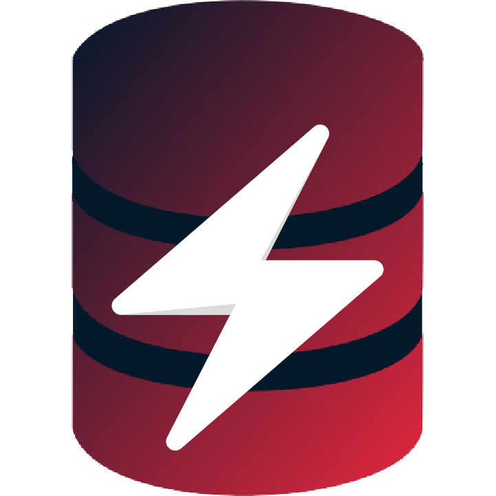

# ZeonDB
Multi-model, high performance, NoSQL database in C++.



## Features
- Suports multiple database models (KV, Document, Graph, SQL-like)
- Simple query language ZQL (Zeon Query Language)
- C Client API
- Cross-platform, depending only on OpenSSL/LibreSSL and libuv

## Getting Started

### Compiling under UNIX systems
```sh
git clone https://codeberg.org/LowByteFox/ZeonDB
cd ZeonDB
cmake -B build -G Ninja
ninja -C build
```

### Compiling under Windows
1. Get msys2
2. Run `mingw64` version of msys2 shell
3. Install dependencies with `pacman -S git pkgconf mingw-w64-x86_64-cmake mingw-w64-x86_64-libressl mingw-w64-x86_64-libuv mingw-w64-x86_64-ninja mingw-w64-x86_64-gcc`
4. Now compile using UNIX compilation instructions

### SDKs
Currently, ZeonDB has JavaScript SDK for only one runtime
- https://github.com/LowByteFox/Zeonic

> Note
> Official repository is at [codeberg](https://codeberg.org/LowByteFox/ZeonDB) <br>
> Mirror of the repository is at [github](https://github.com/LowByteFox/ZeonDB)
